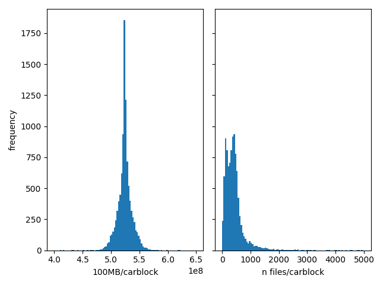
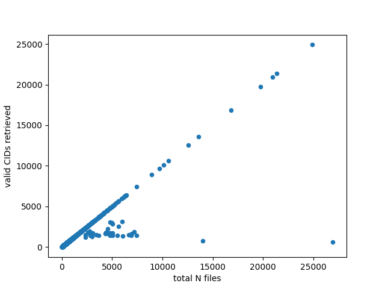

# trove-to-ipfs

HRDAG has been given a trove of about 5 million little files, about 5.5TB, and I don't want to lose them. The files aren't public, but they're not entirely confidential, so it's ok if they're available in a semi-public way. I want to share these files with my partner organizations, so the files need to be accessible. We would rather not use cloud services like Amazon's S3, Dropbox, or Google Drives because, well, we're a human rights group, and we don't trust big companies to prioritize protecting human rights information over frivolous attacks by extremist governments.[^extremist]

[^extremist]: I know that this code and README are hosted by GitHub which is owned my Microsoft. No, I don't trust Microsoft either. The nature of git is that anyone who clones this repo has a complete copy of it, and that copy could be reshared to other git users. The world is so dominated by big tech companies that we cannot fully avoid them without [considerable inconvenience](https://www.kashmirhill.com/stories/goodbyebigfive).

We decided we'd like to experiment with [IPFS](https://ipfs.tech/), a decentralized storage network and protocol for sharing data. As the [Filecoin Foundation for the Decentralized Web](https://ffdweb.org/about/) explains,

> IPFS is a peer-to-peer storage network that promotes the resiliency, immutability, and auditability of data. Through IPFS, content is tracked not by where it is located, but rather by WHAT data is being stored. This means that multiple organizations (or individuals, or communities), can store the same data, and if one of them is taken down, the data remains online. IPFS is an open protocol, which means that there are many implementations in many languages and platforms.

We have been gifted with a pinning service for this project until we can get our own IPFS nodes running. The service is called [Storacha](https://storacha.network/), which provides a couple of advantages for us. We get lots of copies (3-7 copies are pinned throughout the [Filecoin](https://filecoin.io/) network). And Storacha uses some [cool hacks](https://docs-beta.web3.storage/concepts/ucan/) to make the sharing across groups a little easier.

## What are we doing here?

This README explains a little bit of the code I wrote to shepherd the files from janky external USB drives to IPFS. This is a little tricky only because I wanted to keep track of the metadata at every step. And I am exploring the IPFS toolkits to get a sense of what they do well, and what they don't do all that well.

It doesn't matter what the files are. What does matter is that (i) together they are about 5TB, which is a lot to store, and more to share, esp if we don't want to use the standard commercial tools; (ii) I want to store them in IPFS so that my partners can verify that the files are unchanged from the point at which we received them; and (iii) I want to keep the metadata in a postgres database so that we can find what we're looking for (there are additional project-specific reasons to keep the metadata in postgres, but those are outside the scope of this post).

First I indexed the files. I used bash `find` to make a list of all the filenames. I had stored the files on two external USB drives (`STARTPATH1`, `STARTPATH2`). For not-entirely-good reasons, I stored the list of files originally in a sqlite database:
```bash
$ find $STARTPATH -name '*.msg' -printf "%h,%f,%s \n" | sqlite3 $OUTPUTF ".import --csv /dev/stdin fs"
```
`find` outputs the path, filename, and size in bytes as a comma-delimited list (which is fine as long as none of the paths have commas in them). The data goes straight into a sqlite database. I hadn't thought all the way through my workflow, and sqlite wasn't a good place to keep the data, so I moved it into postgres:
```bash
mv fs.db fs.sqlite
sqlite3 fs.sqlite .dump > fs.sql
psql -U pball -c "CREATE DATABASE mydb;"
psql -U pball -d mydb -W < fs.sql
```
Now there's a table in `mydb` called `fs` that has the path, filename, and size of each of the files in the trove. Let's get to work.

### creating _carblocks_

There are about ~5M little files in this collection, and I figured it would be easier to move them into IPFS if I organized them into collections of about 500MB each. Each collection I'm calling a _carblock_. My SQL skills are very, very out-of-date, so I figured it would be easy enough to do in pandas. My thoughts are in `bin/gen-carblock-id.py`, run from the command line, I think the arguments are reasonably comprehensive.

You have to provide your credentials to the postgres server in a separate file that includes `"user" = "myuser", "password" = "mypassword"`.

The script just reads the `fs` table from postgres, calculates a cumulative sum of file sizes, divides the cumulative sum by `1024 * 1024` (a megabyte), and takes the int part as the carblock id. I did a tiny bit of exploring the distribution of carblock sizes, then wrote the carblock id back to postgres.



The histogram on the right suggests that the carblocks are properly clustered at about 500MB/carblock. On the left graph, the number of files per carblock is a little messier (there are 45 carblocks with >5K files). This doesn't seem like it will be a problem, but I guess we'll find out.
### copying carblocks to IPFS

(Note: all the code is in a [public GitHub repo here](https://github.com/HRDAG/trove-to-ipfs), and the paths in the text can be found in the repo). The next step is a little bigger, and my thinking is in `bin/car-to-ipfs.py`. As with the previous step, there's a credentials file, this one to connect you to the IPFS network you're using. In my case, I'm using [storacha's w3cli](https://github.com/storacha/w3cli), and my work is in `bin/car-to-ipfs.py`.

I've added some fields to the postgres table: the time the carblock is made `blocked_tm`; the time it is uploaded `uploaded_tm`, and the URL of the carblock `car_url`.

All the action is in `up_one_carblock()`.  After querying the db to get a list of carblocks (parsed into path, filename), it locks the files by setting a timestamp in `blocked_tm` their records. The idea here is that lots of copies of this script will be running concurrently (with gnu [`parallel`](https://www.gnu.org/software/parallel/)), so the different processes shouldn't process the same carblocks.

The files are compressed and copied to a temporary directory (note: the USB disks where the files were stored had a ton of IO errors as this was running, so this was a good place to log those). Then the files are packed into a carfile. Yeah, I'm packing and uploading in two different steps, I know `w3 up` can do it all at once but I wanted to be able to look at the car before uploading. The pack uses [`ipfs-car`](https://github.com/storacha/ipfs-car) which, for reasons I can't figure out, `npm` won't install, so it's run by `npx`.

After `w3 up` returns `car_url`, the URL and upload time are written to the database. For about 1 carfile in 10, I chose a file at random, downloaded it, and tested it against the original (compressed) copy, logging the result.

Note that the `car_url` is the URL to the directory of files. You can construct a direct link to the file by appending `/$filename` to the URL. There's another way to access the file, which I'll explain later.

And that's that. It took about 4 days to run. The compressed carblocks were about 350MB each, and it took around 90s/carblock to upload (plus another 60s of copying+compression+testing).  I ran 5-10 processes concurrently. By keeping information about the uploads in the postgres database, we can keep track of what has been uploaded already. Building a workflow that can be stopped and restarted (while we fix bugs) is really important in exploration when the steps take multiple days to complete.

### get the metadata

Just to confirm, I got a list of all the car CIDs in my IPFS space (`w3 ls > car_cids.txt`).  This list is a superset of the CIDs I've saved in the database because I made a few repeated carblocks as I tested things. Here's where things started to get a little weirder in ipfs.

I added another helper program: [`kubo`](https://docs.ipfs.tech/install/command-line/).  This tool can do something really cool. First, in another shell I started the daemon (`ipfs daemon --migrate=true`), then I ran this little script:
```bash
#!/bin/bash
# car_cid.txt was created above with `w3 ls > car_cid.txt`
TARGDIR=/var/tmp/mydb

my_func() {
    jfile="$TARGDIR/$1.json"
    if [ ! -f "$jfile" ]; then
        ipfs dag get "$1" > "$jfile"
    fi
}

export -f my_func
cat  /var/tmp/car_did.txt | parallel -j 50 my_func
```
About 3 hours later, I have a json file for each of the car files I uploaded earlier. These json files are great! In the `Links` key, there is a list of files with `Hash`, `Name`, and `Tsize` keys. This is useful to confirm that every file from the trove is in IPFS, and even better, to get the CID (in `Hash`) for the _file_, not just the directory, providing another and more direct means of access.

I mean, it does **seem** like it worked. But unfortunately, the command doesn't quite get all the data.

### saving the metadata

I wanted to store all the information in the json files into the database, and I wanted to do a little more checking. My next bit of work is in `bin/add_file_cids_pg.py`.

First I wanted to check each one to make sure all the files had been uploaded.  This is just a tiny bit of python. Read with the CIDs in IPFS in `car_cids.txt` in a python set, and the CIDs in postgres in a set, the test is prtty simple.
```python
assert cids <= car_cids
print("all file-car cids found in IPFS")
```
(There are a few carfile CIDs in IPFS that are not in postgres because of early tests)

Last I want to write the file CIDs in the json back to the database. This just requires changing some of the strings a little bit: the car's CID is in an URL, so we need to translate back and forth; and the uploaded files are `gz` compressed, so the filename needs to be changed (btw, the compression is why the tsize is different from the fsize).

At this point, I started to find mistakes: `ipfs dag get $CAR_CID` timed out, or just failed, for about a quarter of the carblocks, but very very weirdly, ipfs exited with `returncode==0` so the failure was undetectable.

Here's an even weirder bug. Recall that the uploaded carfiles are essentially directories. For directories with more than about a hundred files, many of the filenames were returned by `ipfs dag get` as hex codes, like this:
```json
    {
      "Hash": {
        "/": "<redacted>"
      },
      "Name": "FF",
      "Tsize": 3808
    }
```
To recall, every filename should end with `.gz`, and none of them are named with hex codes. I got good info back for about 3.5 of my 5.2M files. On to the next solution.

#### parsing the csv

The `kubo` tool can also return a human-readable version of the hash, filesize, and filename with `ipfs ls $CID`.  It looks like this:
```bash
bafkr...h6ee 2086     172...8.gz
bafkr...65xy 2087     172...1.gz
bafkr...6cki 2093     172...3.gz
bafkr...helq 2085     172...4.gz
bafkr...tima 2087     172...6.gz
```
(the `...` in the listing above is redaction) **Great!** So I ran `ipfs ls $CID` for the carfiles that were missing the hash for a specific file. I substantially improved how I was handling the updates to postgres, and the code in general is a lot better in `bin/add_cids_from_csv.py`.

But this didn't get everything either. Around 200 of the carfile CIDs hung and never responded to `ipfs ls $CID`. Others returned only partial listings. I was able to recover about 1.2M of the approximately 1.8M file references that we'd missed on the previous step, leaving around 600K to go.

#### scraping HTML, really?

I was getting pretty anxious about this, and I kept digging into the web interface to the car directories, and I realized that every time I looked for a specific file in a car-directory, it appeared on the webpage. That means that "all" I had to do is retrieve the page and scrape the file information from it.

I really, really hate scraping html, it just feels like everything can go wrong. This wasn't even bad html, to be fair, `https://w3s.link` returns reasonably nice html tables. But still, either or both of `ipfs dag get` or `ipfs ls` should have worked.

Ok, once again: ask postgres for the list of carblocks with missing file info; run a bash script to `curl` each one of the car CIDs; and then scrape the html. My download code is in `scripts/get-html.sh` and the scraping is in `bin/add_cids_from_html.py`.

And this also turned out to be fussy! `curl` failed on most of them -- for around 100 carfile CIDs, `curl` returned only a portion of the directory table, and then crashed.  If I repeatedly re-ran the script calling curl on missing carfile CIDs, occasionally I could get a complete html download (I watched for the closing tag `</html>`), and then I'd have a few more file CIDs. After banging my head on this for a few days, I got down to 137K files missing CIDs.

#### more attempts

I didn't give up. I tried to get the car file with [`lassie`](https://github.com/filecoin-project/lassie/), and for the really complicated cars that are befuddling the `kubo` tools, I found that lassie's `fetch` also failed. Maybe some of the carfiles contain too many file references for the ipfs dag parsing mechanisms? Maybe, but only in some cases.



There doesn't seem to be a correlation between how many files are in a carblock and whether that carblock's metadata is fully retrievable. The smallest carblocks are all fine, up to about 1K records (which I'd noticed earlier). At that point, some of the carblocks start having trouble fully returning the metadata. The same carblocks consistently fail to return, and they do so using all three methods (`ipfs dag get $CID`; `ipfs ls $CID`; and `curl -o $CID.html https://w3s.link/ipfs/$CID`). However, most of the carblocks with lots of files return their metadata without problems, including one really huge carblock (omitted from the graph) with 70K files which returns `ipfs dag get` just fine. So it's not size (or not size alone) that makes some carblocks fail to return the data.

I dunno what's stopping these tools from retrieving the metadata from the last few carblocks.

### what's the problem, really?

I want to emphasize that the data are fine! I can still access a given file via http using the carfile's CID, like this:
```
wget -O $filename https://w3s.link/ipfs/$CARFILE_CID/$filename
```
I've tested a few hundred files for which I cannot get the enclosing carblock's metadata, and they have all passed the `gzip -t` integrity test (lightweight but should be sufficient here).

Here are my lessons learned:
* It's a little slow to upload the files into IPFS, but that could probably be streamlined. Once the files are there, and as long as we remember the space DID, we can recover the file information. But recovery can be a PITA.
* we can get the CIDs in a space by `w3 ls`
* once the file is in ipfs, we can get it back, as long as we know either the file's CID or the file's name and the enclosing carblock's CID.
* We can query the ipfs space for each carblock's directory listing, but it's hit-or-miss. I've found the file CIDs for all but about 135K of the 5.2M files. Still, it should be all of them.

 Now it's time to do something with all these files.
<!-- done -->
